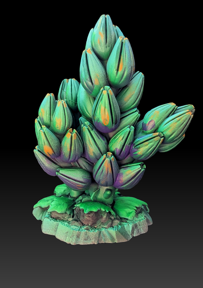

# Model Image Preparation
This script takes an input image of a model, segments the object of interest, adjusts the saturation and contrast of the object, applies a gradient background, and crops the image to the object's bounding box.
## Example

**Input Image:**


**Output Image:**



## Installation
This repository uses poetry for dependency management. To install the dependencies, first install Poetry, and then run the following command in the repository's root directory:

```bash
poetry install
```
This will create a virtual environment and install the required dependencies.

## Usage
To run the script, use the following command:

```bash
poetry run python photo_pipeline/pipeline.py input_path output_path --debug
```
For example:

```bash
poetry run python your_script_name.py examples/example-input.jpg examples/example-output.jpg --debug
```
The --debug option is optional. If provided, the script will display intermediate images during processing.

